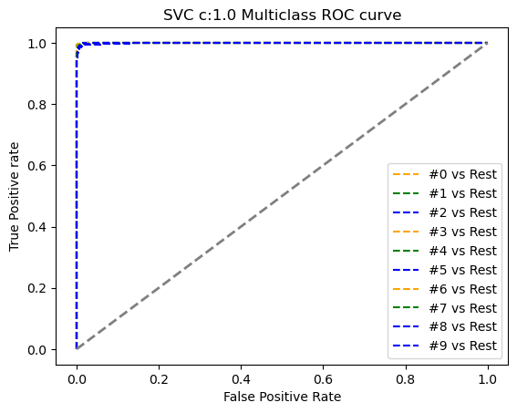
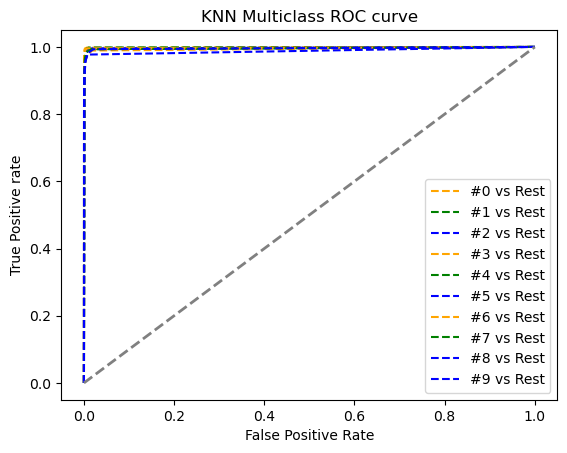
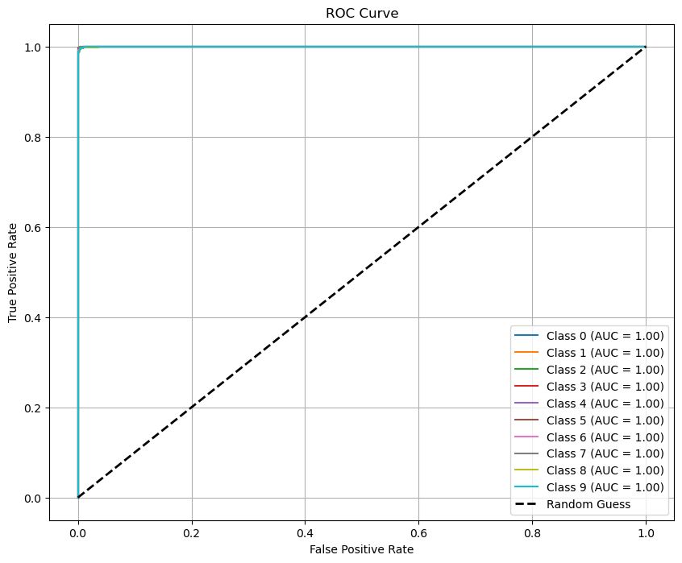
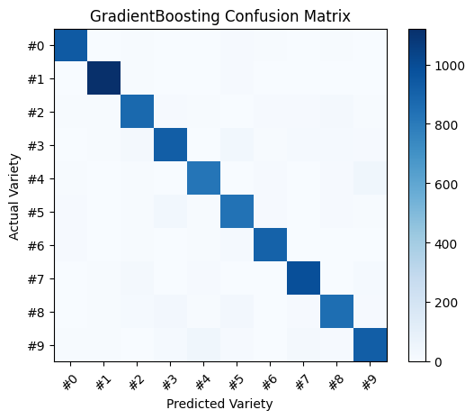
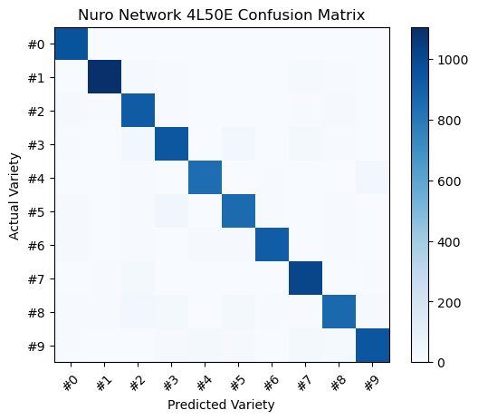
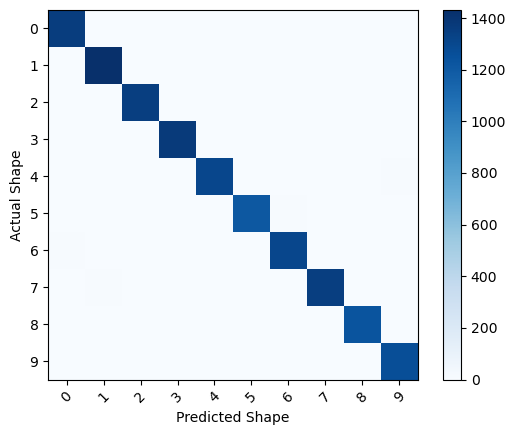
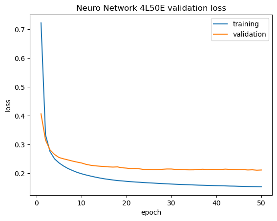
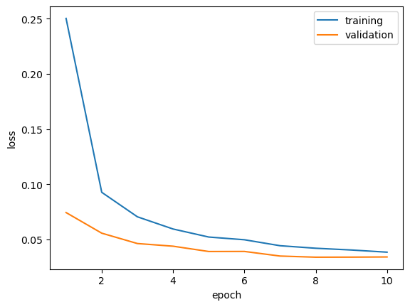

# MNIST Handwritten Digit Recognition

End-to-end **multiclass image classification** on the classic [MNIST](https://en.wikipedia.org/wiki/MNIST_database) benchmark: classical ML baselines, a **feed-forward fully connected network (FF-FCN)**, and a **convolutional neural network (CNN)**—with rigorous evaluation (accuracy, precision, recall, ROC one-vs-rest, confusion matrices, training curves).

Originally developed for **Cloud Computing & Big Data (CCBD)** coursework; this repository is structured so a reviewer can quickly see **problem → approach → evidence**.

---

## Why this repo exists (for reviewers)

- **Clear progression:** tabular ML → dense deep learning → convolutions on image tensors.
- **Reproducible artifacts:** Jupyter notebooks with saved outputs; figures under `assets/` render on GitHub.
- **Honest metrics:** reported numbers below come from executed notebook outputs, not hand-waved “~99%” claims.

---

## Highlights

| Area | What you will find |
|------|---------------------|
| **Data** | 70k samples × 784 features via `sklearn.datasets.fetch_openml("mnist_784")`; train/validation splits and (for CNN) exported PNG tiles for image-folder workflows |
| **Classical ML** | `SVC`, `GradientBoostingClassifier`, **KNN**; pipelines, hyperparameter search, multiclass ROC (OvR) |
| **Deep learning** | **Keras / TensorFlow** `Sequential` models; training vs validation loss; confusion matrices |
| **Best reported test accuracy** | **CNN ~99.03%** (`Project_MINT_CNN_IMG.ipynb`) |

---

## Repository layout

| Notebook | Focus |
|----------|--------|
| `load_data.ipynb` | Data loading / inspection helpers |
| `Project_MINT_ML_Img_Identify.ipynb` | **Phase 1 — Classical ML:** SVC, gradient boosting, KNN; ROC, confusion matrices, metrics |
| `Project_MINT_DNN_IMG_DeepLearning.ipynb` | **Phase 2 — FF-FCN:** flattened 28×28 inputs, dense layers, Keras training loops |
| `Project_MINT_CNN_IMG.ipynb` | **Phase 3 — CNN:** image pipeline (including saving tiles under `data/mint/...`), convolutional model, evaluation |

Supporting files: `summary.csv` (pixel-level summary export from exploration).

---

## Methodology (short)

1. **Objective:** classify digits `0`–`9` from 28×28 grayscale images (784-dimensional feature vectors for vectorized models).
2. **Preprocessing:** OpenML MNIST load; normalization / reshaping as appropriate per model (784-D for sklearn and FCN; 28×28×1 tensors for CNN).
3. **Model selection:** classical models for strong, interpretable baselines and fast iteration; FCN to introduce nonlinear feature learning on pixels; CNN to exploit spatial structure.
4. **Evaluation:** accuracy, precision, recall; **multiclass ROC (one-vs-rest)** where probabilities are available; **confusion matrices** for error analysis (e.g. confusable pairs such as 4/9).

---

## Reported results (from notebook outputs)

These are **point-in-time** results from the checked-in notebooks; re-running may differ slightly with library versions or hardware.

| Phase | Model / setup | Test accuracy (notebook output) | Notes |
|-------|----------------|-----------------------------------|--------|
| Classical ML | **SVC** (e.g. `C=1`, probability for ROC) | **~98.05%** | Average multiclass ROC AUC **~0.9996** (same notebook output) |
| Classical ML | **KNN** (tuned configuration in notebook) | **~97.32%** | Average multiclass ROC AUC **~0.9945** |
| FF-FCN | Keras dense network | **~90.07%** | Validation accuracy in logs peaks **~92–93%** range during training (see notebook) |
| CNN | Convolutional model | **~99.03%** | Strong diagonal on confusion matrix; see `assets/confusion-cnn-mnist.png` |

---

## Figures (`assets/`)

**Multiclass ROC (one-vs-rest) — SVM**

| C = 0.5 | C = 1.0 |
|---------|---------|
|  |  |

**Multiclass ROC — KNN**

**Per-class ROC with reported AUC** (illustrates separation for each digit vs the rest)

**Confusion matrices**

| Gradient boosting | FF-FCN (“4L50E” run) | CNN (MNIST eval) |
|-------------------|----------------------|------------------|
|  |  |  |

**Training dynamics**

| FF-FCN: train vs val loss (50 epochs) | CNN: train vs val loss (10 epochs) |
|---------------------------------------|--------------------------------------|
|  |  |

---

## Tech stack

- **Python 3** · **NumPy** · **pandas** · **Matplotlib**
- **scikit-learn** (datasets, preprocessing, pipelines, classical models, metrics)
- **TensorFlow / Keras** (FF-FCN and CNN)
- **PIL** (image export for CNN data layout)

---

## How to run

1. Clone the repository.
2. Create a virtual environment (recommended) and install dependencies for Jupyter, scikit-learn, TensorFlow, and plotting (exact versions were not pinned in the original coursework environment).
3. Open the notebooks in order: **ML → DNN → CNN** for the same narrative as the README.
4. **Note:** `fetch_openml("mnist_784")` downloads data on first use; ensure network access.

---

## Challenges and limitations

- **MNIST is a baseline, not production OCR:** high scores are expected; real-world handwriting, fonts, and noise are harder.
- **FCN vs CNN:** the FCN ignores spatial locality until depth compensates; the CNN’s inductive bias aligns with images and shows in the **~9 pp** accuracy lift vs the reported FCN test accuracy in this repo.
- **Runtime / scale:** classical models and dense nets on full MNIST are fine for learning; scaling to larger datasets would push you toward efficient dataloaders, mixed precision, and distributed training.

---

## License / attribution

Academic project code. MNIST is a standard benchmark dataset; cite Yann LeCun et al. when reproducing benchmark comparisons in publications.

If you use this repository in an application or portfolio, a one-line link back to the repo is appreciated.
